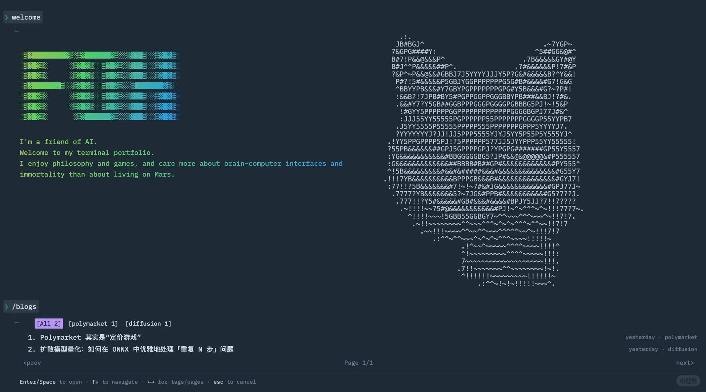

<div align="center">



# Terminal Portfolio

[](LICENSE)
[](https://react.dev/)
[](https://www.typescriptlang.org/)
[](https://vitejs.dev/)

**A terminal-style portfolio website with interactive command-line interface**

[**Live Demo**](https://parallelarc.github.io) &nbsp;•&nbsp; [Features](#-features) &nbsp;•&nbsp; [Quick Start](#-quick-start)

</div>

---

## &nbsp; Overview

A modern portfolio website built as an interactive terminal experience. Features a command-line interface with plugin support, theme switching, and an extensible command system — perfect for developers who want to showcase their work in a unique way.

## &nbsp; Features

| Feature | Description |
|---------|-------------|
| **Command-line Interface** | Interactive terminal with command history, autocomplete, and keyboard shortcuts |
| **Plugin System** | Extensible architecture for adding custom commands and features |
| **Command Registry** | Centralized command management with aliases and categories |
| **Event System** | Pub-sub pattern for plugin communication |
| **State Management** | Zustand stores for terminal and theme state |
| **PWA Support** | Installable as a Progressive Web App |

## &nbsp; Commands

| Command | Description |
|---------|-------------|
| `about` | Display information about the site owner |
| `blog` | View blog posts (fetches from GitHub Issues) |
| `contact` | Show contact information and social links |
| `education` | Display educational background |
| `projects` | Showcase projects portfolio |
| `welcome` | Display welcome message |
| `clear` | Clear terminal screen |

## &nbsp; Tech Stack

- **React 18** — UI library
- **TypeScript** — Type safety
- **Vite** — Build tool
- **Styled Components** — CSS-in-JS styling
- **Zustand** — State management
- **Vitest** — Testing framework
- **React Icons** — Icon library

## &nbsp; Quick Start

```bash
# Clone the repository
git clone https://github.com/parallelarc/parallelarc.github.io.git
cd parallelarc.github.io

# Install dependencies
npm install

# Start development server
npm run dev

# Build for production
npm run build
```

## &nbsp; Development

```bash
# Run tests
npm test

# Run tests with coverage
npm run coverage

# Lint code
npm run lint

# Format code
npm run format
```

## &nbsp; Architecture

### Command System

Commands are registered through the `CommandRegistry` singleton:

```ts
import { commandRegistry } from './core/CommandRegistry';

commandRegistry.register({
  id: 'mycmd',
  name: 'mycmd',
  description: 'My command',
  component: () => import('./mycmd'),
  aliases: ['mc'],
  category: 'info',
});
```

### Plugin System

Plugins receive a `PluginContext` with access to command registration, state, and events:

```ts
import type { Plugin } from './types/plugin';

const myPlugin: Plugin = {
  name: 'my-plugin',
  version: '1.0.0',
  init: (context) => {
    context.registerCommand({ /* ... */ });
    context.on('my-event', (data) => { /* ... */ });
  },
  destroy: () => { /* cleanup */ },
};

pluginManager.load(myPlugin);
```

### Project Structure

```
src/
├── App.tsx                 # Theme provider, global layout
├── components/
│   ├── Terminal.tsx        # Core terminal component
│   ├── Output.tsx          # Command output renderer
│   ├── TermInfo.tsx        # Prompt/path display
│   └── styles/             # Styled components themes
├── commands/               # Command implementations
├── core/                   # CommandRegistry, PluginManager, EventBus
├── hooks/                  # Custom React hooks
├── stores/                 # Zustand stores
├── types/                  # TypeScript definitions
└── utils/                  # Helper functions
```

## &nbsp; Deployment

This project uses GitHub Actions for automatic deployment to GitHub Pages.

### Fork & Deploy

1. **Fork this repository**
2. **Enable GitHub Pages** in your fork settings:
   - Go to Settings → Pages
   - Source: GitHub Actions
3. **Push to main branch** — automatic deployment begins!

The deployment automatically detects your fork and uses your repository for blog posts. No configuration needed!

### Blog Configuration

Blog posts are fetched from your fork's GitHub Issues with the `blog` label. To add posts:

1. Create a new issue in your forked repository
2. Add the `blog` label
3. The site will automatically display it

**Optional**: Customize the blog label by setting `BLOG_LABEL` in your repository Settings → Variables (default: `blog`)

**Local development**: Edit `.env` to match your GitHub username:
```bash
VITE_GITHUB_OWNER=your-username
VITE_GITHUB_BLOG_REPO=your-username.github.io
```

---

## &nbsp; License

[MIT](LICENSE) © [parallelarc](https://github.com/parallelarc)
