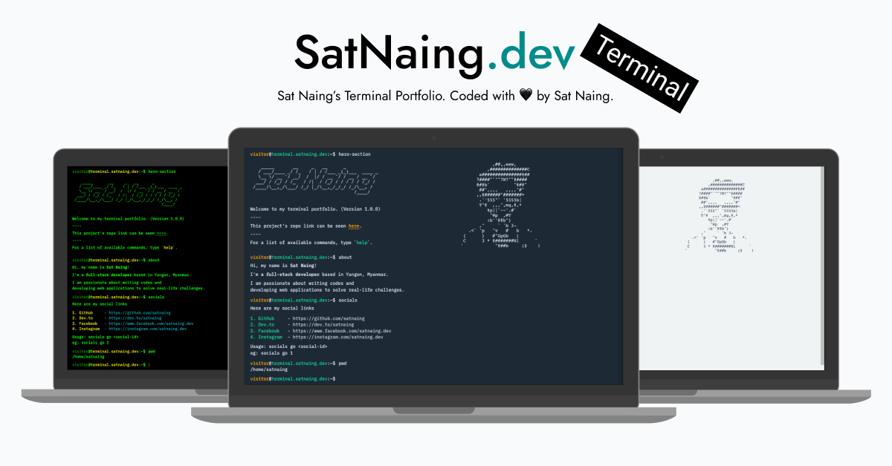

# Terminal Portfolio



A minimalist, keyboard-first portfolio for **Ren Jianwei**. Visitors interact with the site through terminal-style commands such as `about`, `projects`, or `themes`, making it feel like a CLI session while still running as a modern React + TypeScript SPA.

---

## Features

- Fast terminal input with history (`↑ / ↓`) and autocomplete (`Tab` / `Ctrl+i`).
- Six built-in themes and full keyboard shortcuts (try `themes`, `history`, `clear`).
- Responsive layout that works on laptops, tablets, and phones.
- PWA/offline support and thorough Vitest coverage.

---

## Tech Stack

- React 18 + TypeScript
- styled-components + styled-normalize
- Vite, pnpm, ESLint, Prettier, Husky
- Vitest + React Testing Library

---

## Core Commands

| Command      | Purpose                           |
| ------------ | --------------------------------- |
| `help`       | List all available commands.       |
| `about`      | Show background + skills.          |
| `projects`   | Highlight selected work.           |
| `education`  | Academic history.                  |
| `socials`    | Links to GitHub, Steam, etc.       |
| `contact`    | Contact card + mailto shortcut.    |
| `themes`     | Cycle through the theme presets.   |
| `history`    | Print command history.             |
| `clear`      | Reset the terminal view.           |

> Tip: `Ctrl+l` also clears the terminal.

---

## Getting Started

```bash
git clone https://github.com/parallelarc/terminal-portfolio.git
cd terminal-portfolio
pnpm install
pnpm dev
```

The dev server runs at `http://localhost:5173` with HMR enabled.

---

## Useful Scripts

| Script             | Description                     |
| ------------------ | -------------------------------- |
| `pnpm dev`         | Start Vite dev server.           |
| `pnpm build`       | Type-check and bundle for prod.  |
| `pnpm preview`     | Preview the production build.    |
| `pnpm test`        | Run Vitest in watch mode.        |
| `pnpm test:once`   | Run the full suite once.         |
| `pnpm lint`        | ESLint across the repo.          |
| `pnpm format`      | Format files with Prettier.      |

Before shipping, run `pnpm lint && pnpm test:once && pnpm build`.

---

## Project Structure

```
src/
├─ components/
│  ├─ Terminal.tsx        # Input, history, command registry
│  ├─ Output.tsx          # Maps commands to output components
│  ├─ commands/           # about, projects, socials, etc.
│  └─ styles/             # Global + theme-specific styles
├─ hooks/
│  └─ useTheme.ts         # Theme storage + switching
├─ utils/                 # Autocomplete + storage helpers
└─ test/                  # Vitest suites
```

---

## Author

- **Original project**: [Sat Naing](https://github.com/satnaing) · [satnaing/terminal-portfolio](https://github.com/satnaing/terminal-portfolio)
- **Fork maintainer**: Ren Jianwei ([@parallelarc](https://github.com/parallelarc))
